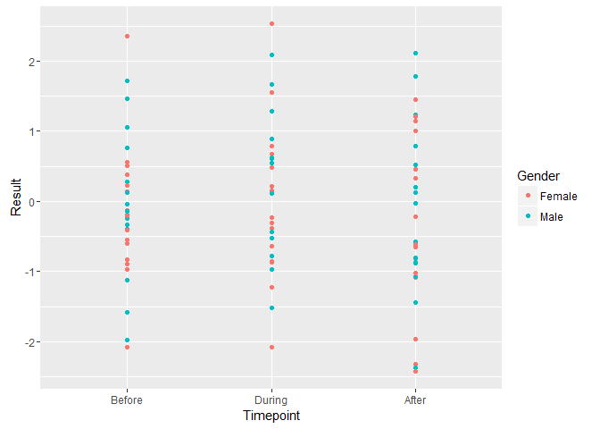
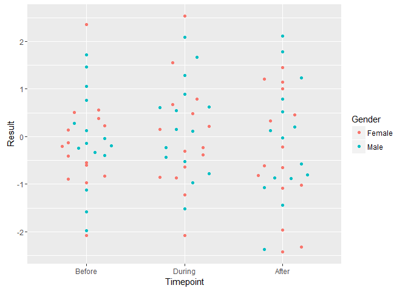
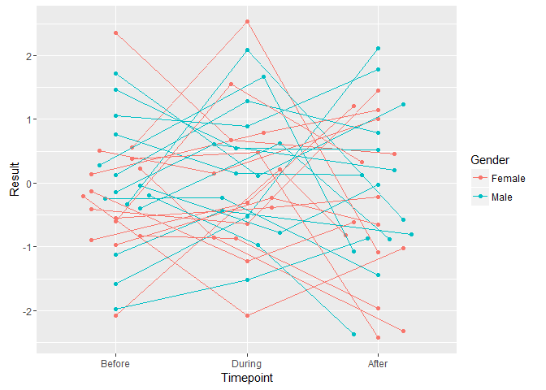

<!-- README.md is generated from README.Rmd. Please edit that file -->
Swarm: Beeswarm plots for ggplot2
=================================

Go from this:

``` r
d <- data.frame(Result = rnorm(90), 
   Timepoint = factor(c("Before", "During", "After"), 
      levels = c("Before", "During", "After")),
   Gender = c(rep("Male", 3), rep("Female", 3)),
   Individual = rep(1:30, each = 3) 
   )

library(ggplot2)
ggplot(d, aes(y = Result, x = Timepoint, color = Gender)) + 
   geom_point()
```



To this:

``` r
ggplot(d, aes(y = Result, x = Timepoint, color = Gender)) + 
   geom_point(position = swarm::position_swarm(width = 0.25))
```



You can even keep track of pairing:

``` r
ggplot(d, aes(y = Result, x = Timepoint, color = Gender)) + 
   geom_point(position = swarm::position_swarm(width = 0.25)) + 
   geom_line(aes(group = Individual), 
      position = swarm::position_swarm(width = 0.25))
```



Installation
------------

``` r
# install.packages("devtools")
devtools::install_github("seaaan/swarm")
```
